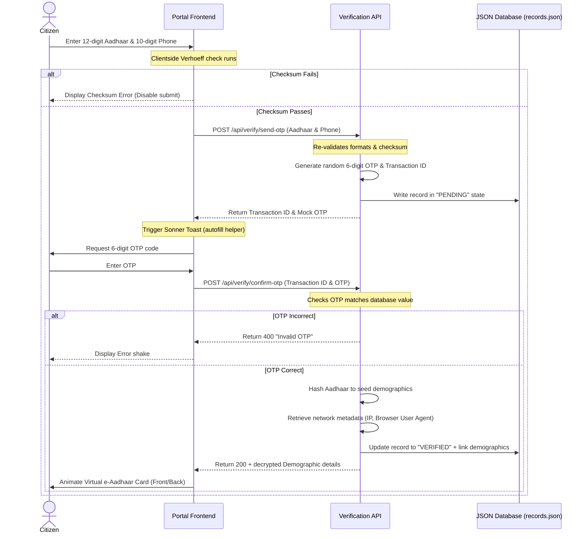

# Aadhaar Verification & e-Card Generation Guide

This guide explains the technical mechanics of the Aadhaar validation and verification process implemented in this application.

---

## 📐 1. Aadhaar Checksum Validation: The Verhoeff Algorithm

A standard Indian Aadhaar number is a **12-digit number** where the first 11 digits represent the citizen identifier, and the 12th digit is a mathematically calculated checksum. 

Aadhaar cards use the **Verhoeff algorithm** (developed by Dutch mathematician Jacobus Verhoeff in 1969). Unlike simple modulo-10 checksums (like the Luhn algorithm used in credit cards), the Verhoeff algorithm uses dihedral group $D_5$ multiplication tables and permutation matrices to catch **single-digit transcriptions** (e.g., typing `3` instead of `8`) and **transposition errors** (e.g., typing `38` instead of `83`).

### How the Algorithm Works in Code
The algorithm runs on three main tables located in [verhoeff.ts](file:///f:/Aadhar%20card%20info/src/lib/verhoeff.ts):

1. **Multiplication Table ($d$)**: Based on the dihedral group $D_5$ (symmetries of a regular pentagon).
2. **Permutation Table ($p$)**: Shifts digit values dynamically based on their index to detect transpositions.
3. **Inverse Table ($inv$)**: Returns the inverse operations to locate the required checksum digit.

#### Checksum Validation Function:
To validate a 12-digit Aadhaar number:
1. Reverse the digits of the number: $a_0, a_1, \dots, a_{11}$ (where $a_0$ is the checksum digit).
2. Calculate the checksum $c$:
   $$c = \left( \dots \left( d\left[d\left[0\right]\left[p\left[0\right]\left[a_0\right]\right]\right]\left[p\left[1\right]\left[a_1\right]\right]\right) \dots \right)\left[p\left[11\right]\left[a_{11}\right]\right]$$
3. If $c == 0$, the number is mathematically valid.

```typescript
export function isValidAadhaar(aadhaar: string): boolean {
  const clean = aadhaar.replace(/\s+/g, '');
  if (clean.length !== 12 || clean.startsWith('0') || clean.startsWith('1')) {
    return false;
  }
  
  let c = 0;
  const digits = clean.split('').map(Number).reverse();

  for (let i = 0; i < digits.length; i++) {
    c = d[c][p[i % 8][digits[i]]];
  }

  return c === 0;
}
```

---

## 🔄 2. Step-by-Step Verification Lifecycle

The application mimics UIDAI's double-factor authentication flow (Aadhaar Checksum + Mobile OTP Verification):



---

## 👤 3. Deterministic Demographics Generator

To make the simulation realistic, instead of generating completely random details every time you verify a card, the server uses a **deterministic hashing algorithm** in [db.ts](file:///f:/Aadhar%20card%20info/src/lib/db.ts):

1. The server cleanses the Aadhaar number and loops through each character's charCode to calculate a numeric hash.
2. This hash is used to select items from preset arrays (Male names, Female names, Fathers' names, streets, cities, and CSS background gradients).
3. **The Result**: If you enter the Aadhaar number `2834 9120 5410` once, verify it, clear the logs, and verify it again later, it will **always** yield the exact same citizen details (e.g. *Aarav Sharma, DOB: 14/06/1982, Bengaluru*). 
4. This deterministic behavior accurately mocks how a real Central Identities Data Repository (CIDR) behaves without needing an active database connection.

---

## 📇 4. e-Aadhaar Card Anatomy

The success screen constructs a virtual copy of a physical Aadhaar card:

* **Bilingual Fields**: Renders names and labels in both English and Hindi.
* **3D Perspective Flipping**: Uses CSS 3D transforms (`transform-style: preserve-3d` and `backface-visibility: hidden`) to flip the card when clicked, revealing the front or back.
* **Interactive QR Code**: Renders an SVG vector matrix with a green scanner animation bar sweeping vertically.
* **Audit Signature**: Displays UIDAI's signature verification badge (`✓ SIGNATURE VERIFIED`).
* **Print Layout**: Custom `@media print` CSS rules hide page elements (headers, footers, toggles, buttons) and render the front and back card templates on white pages, ready for physical printing.
