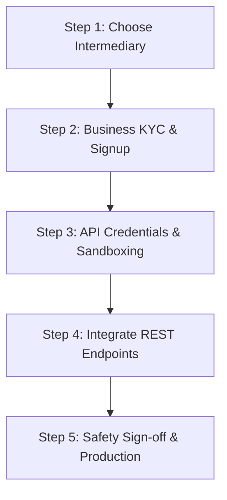

# Roadmap: Connecting to the Official UIDAI Aadhaar Ecosystem

To transition from this simulation to the official government system, your organization must register with the **Unique Identification Authority of India (UIDAI)** or partner with an authorized intermediary. Direct connection to government databases is strictly regulated under the Indian Aadhaar Act (2016).

This document outlines the legal paths, technical requirements, and setup steps required for production integration.

---

## 🗺️ 1. Choose Your Integration Model

There are two primary paths for organizations wishing to verify Aadhaar cards or fetch demographic data:

### Route A: The Sub-AUA Model (Recommended for Startups, Fintechs, & SMEs)
Instead of connecting directly to UIDAI, you partner with an existing **Aadhaar Service Agency (ASA)** or a licensed third-party KYC aggregator (e.g., **Digio, Signzy, Karza Technologies, Cashfree, or Zoe**).
* **Setup Time**: 1 to 3 weeks.
* **Capital Cost**: Low (Pay-per-transaction API pricing + small monthly maintenance).
* **Compliance**: Intermediaries handle the complex hardware security module (HSM) compliance and direct audits.

### Route B: Direct AUA/KUA Registration (For Banks, Telecoms, and Enterprise)
You register directly with UIDAI as an **Aadhaar User Agency (AUA)** or **e-KYC User Agency (KUA)**.
* **Setup Time**: 3 to 6 months.
* **Capital Cost**: Very High (Requires ₹10L+ in licensing fees, bank guarantees, and dedicated server audits).
* **Infrastructure**: Strict mandate for ISO 27001 audited data centers and Hardware Security Modules (HSMs) for encryption.

---

## 🛠️ 2. Official Verification Methods Available

Once registered, you can choose from several official API integration protocols:

1. **Aadhaar OTP e-KYC (Matches this portal's UX)**
   * **How it works**: The user submits their Aadhaar number. UIDAI sends a 6-digit OTP to their registered mobile. The user enters the OTP, and UIDAI returns digitally signed demographic XML data (Name, DOB, Gender, Address, and Photo).
   * **Use Case**: Remote onboarding, digital account opening.

2. **Aadhaar Secure QR Code (Offline KYC)**
   * **How it works**: Every Aadhaar card has a secure, digitally signed QR code containing name, gender, DOB, address, and photo. You scan this QR offline and verify it against UIDAI’s public key.
   * **Use Case**: In-person verification, instant verification without sending OTPs.

3. **Biometric e-KYC**
   * **How it works**: The citizen places their finger or iris on an **RD (Registered Device) Service** scanner. The device encrypts the biometric packet and validates it directly against UIDAI.
   * **Use Case**: In-branch onboarding, retail KYC.

---

## 🚀 3. Step-by-Step Implementation Roadmap

If you decide to go with the **Sub-AUA (API Intermediary) Route**, follow these implementation steps:

### Step 1: Choose an API Provider
Sign up with an authorized Indian API aggregator. Top providers include:
* **Digio** (Very popular for Aadhaar e-Sign and e-KYC APIs).
* **Signzy** (Fintech-focused identity intelligence).
* **Karza Technologies** (Comprehensive corporate verification suites).

### Step 2: Complete Corporate KYC
You must submit documents showing you are a legally registered business in India:
* Company PAN Card.
* Certificate of Incorporation (COI) or Partnership Deed.
* GST Certificate.
* Authorized Signatory authorization.

### Step 3: Acquire API Sandboxes
The provider will issue sandbox API credentials (usually a Client ID, API Key, and Secret) and provide API documentation.

### Step 4: Code Integration
You will replace our mock endpoints with their official REST APIs. Typically, this is done in two calls:
* **Call 1: Submit Aadhaar & Send OTP**
  * Send `aadhaar_number` to provider's send-otp endpoint.
  * The provider returns a `reference_id` (or `request_id`).
* **Call 2: Submit Code & Fetch KYC**
  * Send the `reference_id` and the user-entered `otp` to their verification check endpoint.
  * The provider queries UIDAI and returns the verified citizen’s profile object.

### Step 5: Go Live
Submit your app for a brief security audit by your provider, verify that your client database encrypts Aadhaar numbers at rest (UIDAI compliance), swap sandbox keys for production keys, and go live.
